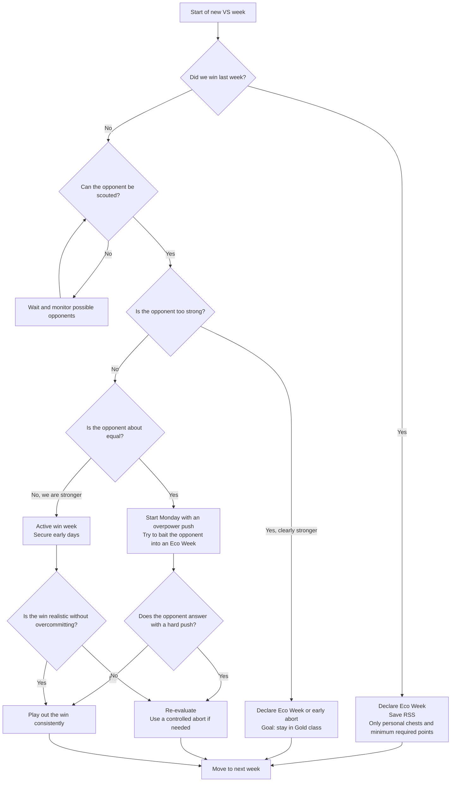
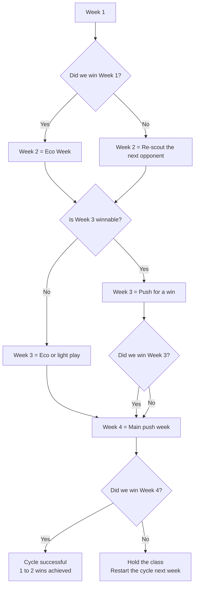

# VS Decision Tree

## Weekly Decision Tree

```mermaid
flowchart TD
    A[Start of new VS week] --> B{Did we win last week?}

        B -->|Yes| C[Declare Eco Week<br>Save RSS<br>Only personal chests and minimum required points]
            B -->|No| D{Can the opponent be scouted?}

                D -->|No| E[Wait and monitor possible opponents]
                    E --> D

                        D -->|Yes| F{Is the opponent too strong?}

                            F -->|Yes, clearly stronger| G[Declare Eco Week or early abort<br>Goal: stay in Gold class]
                                F -->|No| H{Is the opponent about equal?}

                                    H -->|Yes| I[Start Monday with an overpower push<br>Try to bait the opponent into an Eco Week]
                                        H -->|No, we are stronger| J[Active win week<br>Secure early days]

                                            I --> K{Does the opponent answer with a hard push?}
                                                K -->|Yes| L[Re-evaluate<br>Use a controlled abort if needed]
                                                    K -->|No| M[Play out the win consistently]

                                                        J --> N{Is the win realistic without overcommitting?}
                                                            N -->|Yes| M
                                                                N -->|No| L

                                                                    C --> O[Move to next week]
                                                                        G --> O
                                                                            L --> O
                                                                                M --> O
```

## 4-Week Cycle

```mermaid
flowchart TD
    A[Week 1] --> B{Did we win Week 1?}
        B -->|Yes| C[Week 2 = Eco Week]
            B -->|No| D[Week 2 = Re-scout the next opponent]

                C --> E{Is Week 3 winnable?}
                    D --> E

                        E -->|Yes| F[Week 3 = Push for a win]
                            E -->|No| G[Week 3 = Eco or light play]

                                F --> H{Did we win Week 3?}
                                    G --> I[Week 4 = Main push week]
                                        H -->|Yes| I
                                            H -->|No| I

                                                I --> J{Did we win Week 4?}
                                                    J -->|Yes| K[Cycle successful<br>1 to 2 wins achieved]
                                                        J -->|No| L[Hold the class<br>Restart the cycle next week]
```